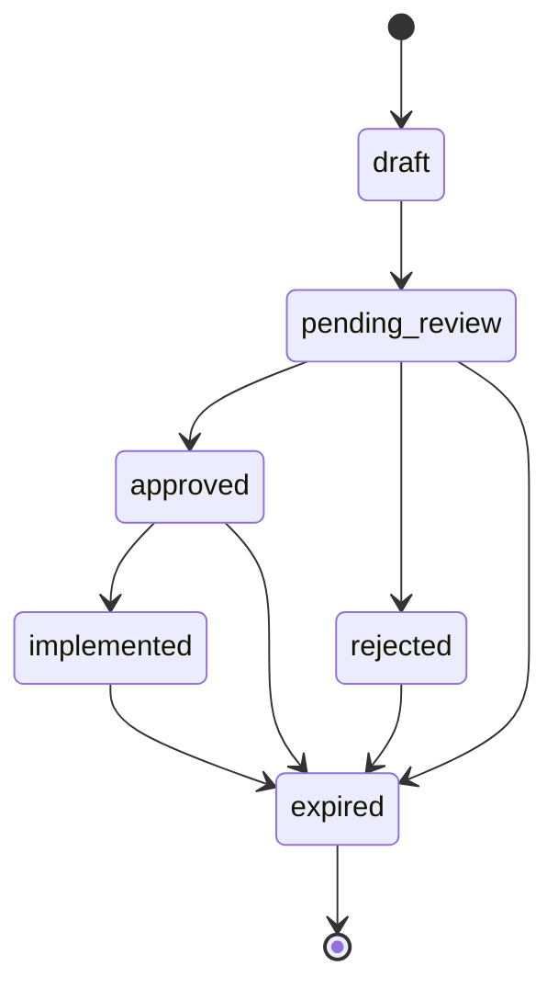

# Constitutional Decision Lifecycle

The Constitutional Decision Lifecycle adds explicit governance enforcement on top of the Evidence-Linked Decision Foundation. It exists so an auditor can reconstruct what decision was made, why it was approved, who implemented it, and what outcome resulted from structured lineage alone.

This layer is intentionally not machine learning, not a memory system, not a dashboard, not a recommendation engine, and not a constitutional scoring model.

## Lifecycle

```text
Evidence
↓
Recommendation
↓
Decision
↓
Approval
↓
Implementation
↓
Outcome
```

## State Machine Diagram



## Transition Rules

| Current status | Allowed target statuses |
| --- | --- |
| `draft` | `pending_review` |
| `pending_review` | `approved`, `rejected`, `expired` |
| `approved` | `implemented`, `expired` |
| `rejected` | `expired` |
| `implemented` | `expired` |
| `expired` | none |

Illegal transitions such as `draft` → `approved`, `draft` → `implemented`, `approved` → `draft`, and `expired` → anything are rejected by `validateDecisionTransition()` before persistence.

## Approval Governance

A decision can only become `approved` after it is submitted for review. The `approveDecision()` service records `approved_by` and `approved_at`; `rejectDecision()` records `rejected_by`, `rejected_at`, and closes the decision.

## Implementation Governance

A decision cannot become `implemented` unless both `approved_at` and `approved_by` already exist. `implementDecision()` records a `DecisionImplementationRecord` using:

- `implemented_by`
- `implemented_at`
- `implementation_notes`

The implementation record is part of lineage and audit package export.

## Outcome Correlation

Decision outcomes are persisted in `decision_outcomes` and are directly linked to `project_decisions` by `decision_id`, with workspace and project identifiers preserved for tenant isolation.

Outcome types:

- `risk_reduction`
- `schedule_improvement`
- `cost_avoidance`
- `stakeholder_alignment`
- `resource_optimization`
- `governance_compliance`
- `other`

Outcome statuses:

- `success`
- `partial_success`
- `failure`
- `unknown`

`recordDecisionOutcome()` persists the outcome, links it to the decision, and emits platform events with `correlation_id` and `causation_id` lineage.

## Platform Events Emitted

Decision lifecycle events:

- `DECISION_CREATED`
- `DECISION_SUBMITTED`
- `DECISION_APPROVED`
- `DECISION_REJECTED`
- `DECISION_IMPLEMENTED`
- `DECISION_IMPLEMENTATION_RECORDED`
- `DECISION_EXPIRED`

Outcome events:

- `DECISION_OUTCOME_RECORDED`
- `DECISION_OUTCOME_SUCCESS`
- `DECISION_OUTCOME_PARTIAL_SUCCESS`
- `DECISION_OUTCOME_FAILURE`

## Lineage Reconstruction

`buildDecisionLineage()` returns:

```ts
{
  evidence,
  recommendations,
  approvals,
  implementation,
  outcomes,
  events
}
```

This answers the post-decision audit question: "What happened after this decision?"

## Audit Package V2

`exportDecisionAuditPackage()` includes:

- evidence
- decision
- approvals
- implementation
- outcomes
- effectiveness snapshot
- event history

The package reconstructs:

```text
Evidence → Decision → Approval → Implementation → Outcome
```

## Decision Effectiveness Snapshot

`DecisionEffectivenessSnapshot` is foundational audit data, not analytics. It captures:

- `decisionId`
- `decisionType`
- `approvalDuration`
- `timeToImplementation`
- `outcomeStatus`
- `evidenceCount`
- `recommendationPresent`

## RLS and Authorization

The lifecycle follows the existing workspace model:

- workspace members can read outcomes
- existing approver roles approve and reject decisions
- decision owners record implementation through service governance
- authorized workspace members record outcomes
- cross-workspace access is denied by workspace-scoped RLS predicates

No new authorization system is introduced.

## Example Lifecycle

1. Evidence is linked to a draft decision.
2. A recommendation may be referenced by `recommendation_id`.
3. The decision owner submits the decision: `draft` → `pending_review`.
4. An approver approves the decision: `pending_review` → `approved`.
5. The owner implements it: `approved` → `implemented`, with implementation metadata.
6. An authorized member records an outcome, such as `risk_reduction` with `success`.
7. Audit export reconstructs evidence, approval, implementation, outcome, and event history.

## Future Extension Points

Future work may add richer reporting or dashboard surfaces on top of this structured audit data. Future work must preserve the state machine, approval-before-implementation guard, outcome linkage, event lineage, and workspace RLS boundaries.

Non-goals remain explicit: No ML, No embeddings, No vector databases, No memory systems, No recommendation engine changes, No dashboards, No reporting UI, No constitutional scores, and No learning extraction.
